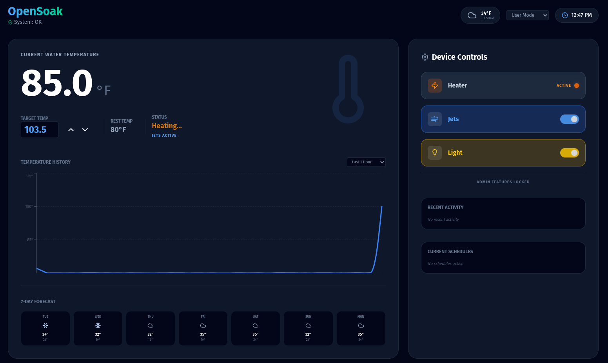
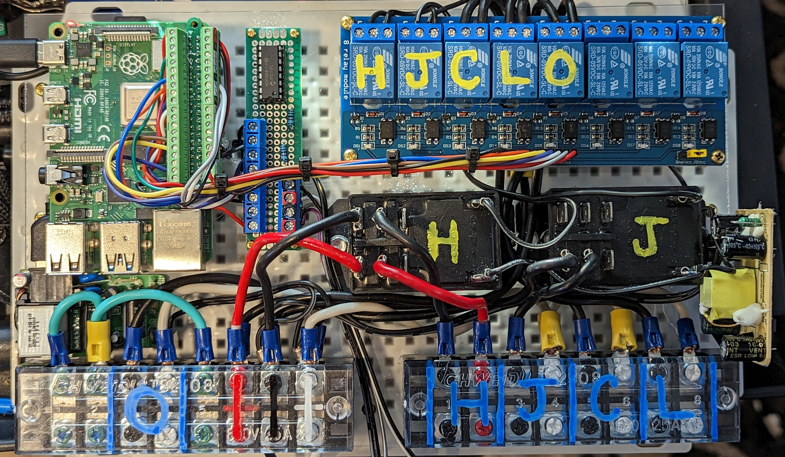

# OpenSoak 🛁

OpenSoak is a modern, open-source hot tub control system designed to run on a Raspberry Pi. It replaces traditional hardware controllers with a safety-first Python engine, a robust FastAPI REST API, and a beautiful React-based web dashboard.



## 🚀 Features

-   **Safety-First Design:** 
    -   **Heater Interlock:** Hardware and software-level logic ensures the heater only runs when the circulation pump is active and flow is detected.
    -   **High-Temp Cutoff:** Automatic emergency shutdown if the water exceeds the user-configurable high limit.
-   **Modern Web UI:** A responsive, dark-mode dashboard built with React and Tailwind CSS.
-   **Intelligent Heating:** Hysteresis-based temperature control with "Rest" and "Soak" temperature modes.
-   **Energy Tracking:** Real-time runtime monitoring and cost estimation for all system components.
-   **Native Scheduler:** Set heating, cleaning, and ozone windows directly in the app.
-   **Hardware Simulation:** Test the entire logic engine on any computer without needing a Raspberry Pi.

## 🛠 Hardware Architecture

OpenSoak is designed to interface with standard spa equipment using an 8-channel relay board and high-precision thermistors.

-   **Raspberry Pi:** Core compute module (GPIO control + API).
-   **8-Channel Relay Board:** Controls high-voltage loads (Heater, Pumps, Lights, Ozone).
-   **MCP3008 ADC:** Interfaces with 10k thermistors for water and hi-limit temperature monitoring.
-   **Physical Interlocks:** (Recommended) A flow switch should be wired to ensure the heater cannot activate without water movement.



## 📦 Installation

### 1. Clone the repository
```bash
git clone https://github.com/mcglothi/opensoak.git
cd opensoak
```

### 2. Automated Setup
Run the setup script to create a Python virtual environment and install all dependencies:
```bash
./scripts/setup.sh
```

### 3. Configuration
Edit `backend/.env` to match your specific GPIO pinout and temperature thresholds.

### 4. Run Development Servers
```bash
./scripts/start.sh
```
Access the dashboard at `http://<your-pi-ip>:5173` and the API docs at `http://<your-pi-ip>:8000/docs`.

## 🛡 Safety Warning

**Use at your own risk.** Controlling high-voltage hot tub equipment (heaters, pumps) is inherently dangerous. This software is provided "as is" without warranty. Always use a GFCI breaker and consult a qualified electrician when wiring your hot tub controller.

## 📄 License

MIT