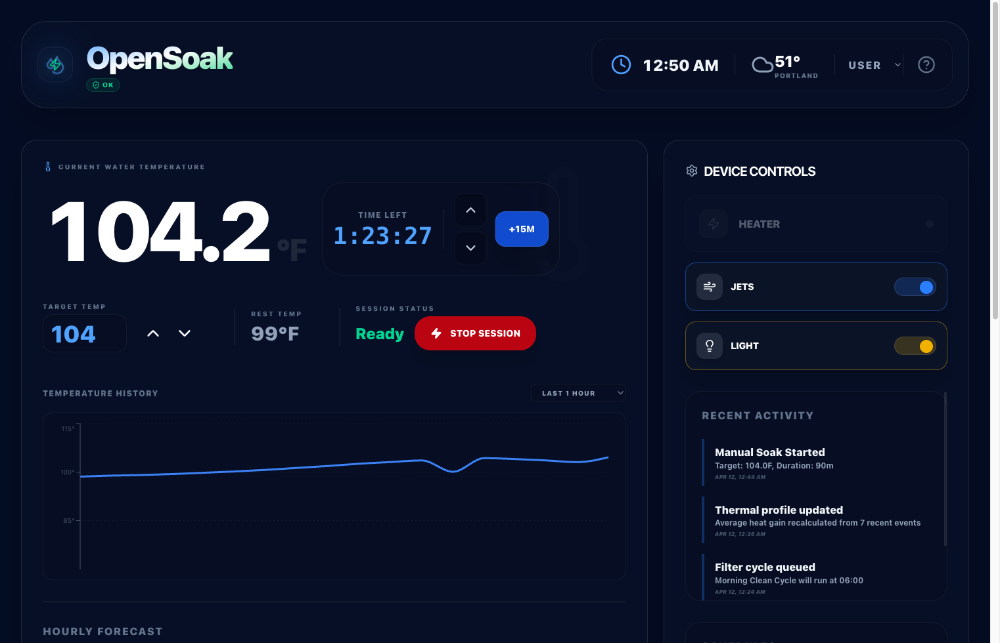
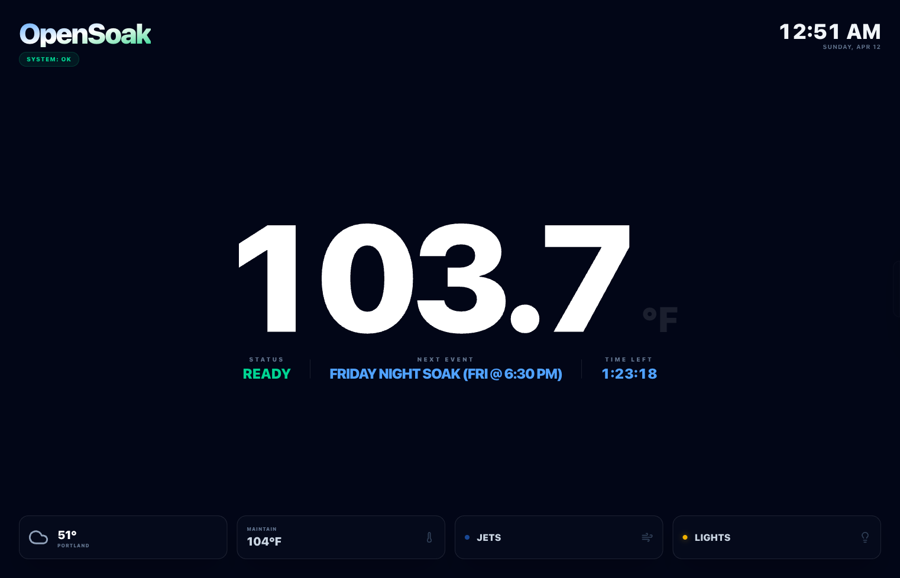
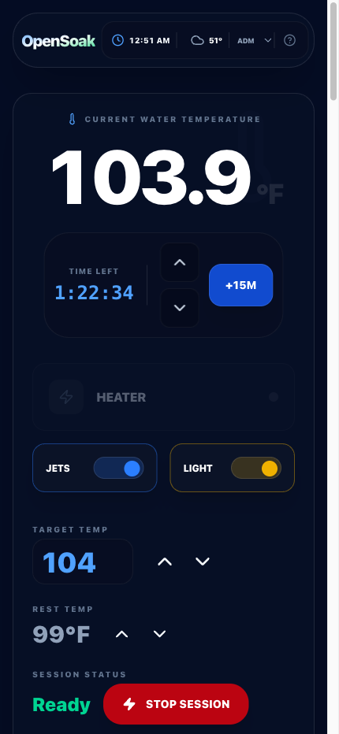

# OpenSoak 🛁

OpenSoak is a modern, open-source hot tub control system designed to run on a Raspberry Pi. It replaces traditional hardware controllers with a safety-first Python engine, a robust FastAPI REST API, and a beautiful React-based web dashboard.



## 📸 Screenshots

### Web Interface
| User Mode (Active Soak) | Admin Mode (Settings) | Viewer Mode |
| :---: | :---: | :---: |
| <a href="docs/screenshots/Screenshot-User.png"></a> | <a href="docs/screenshots/Screenshot-Admin.png"></a> | <a href="docs/screenshots/Screenshot-Viewer.png"></a> |

### Mobile Experience
| Mobile View 1 | Mobile View 2 |
| :---: | :---: |
| <a href="docs/screenshots/Screenshot-Mobile-Admin1.png"></a> | <a href="docs/screenshots/Screenshot-Mobile-Admin2.png"></a> |

## 🚀 Features

-   **Safety-First Engineering:** 
    -   **Heater Interlock:** Intelligent software and hardware logic prevents the heater from engaging without verified water flow and an active circulation pump.
    -   **Configurable High-Limit:** Automatic emergency shutdown triggers if the water temperature exceeds your defined safety threshold.
-   **Modern Dashboard:** A responsive, dark-mode web interface built with React, Tailwind CSS, and real-time animations.
-   **Precision Control:** Hysteresis-based heating with dedicated "Rest" and "Soak" temperature modes for maximum efficiency.
-   **Energy Monitoring:** Comprehensive real-time tracking of component runtimes and estimated operating costs.
-   **Automated Scheduling:** Intuitive in-app scheduler for heating, filtration (clean), and ozone purification cycles.
-   **Hardware Emulation:** Full simulation mode allows for logic testing and UI development on any PC without physical hardware.

## 🛠 Hardware Architecture

OpenSoak is designed to interface with standard spa equipment using industrial-grade components and a modular wiring approach.

-   **Raspberry Pi:** Serves as the central compute module, hosting the FastAPI backend and React frontend.
-   **8-Channel Relay Board:** Provides isolated control over high-voltage loads including heaters, pumps, lights, and ozone generators.
-   **MCP3008 ADC:** Enables high-precision analog-to-digital conversion for temperature monitoring.
-   **10k Thermistors:** Reliable temperature sensing using Steinhart-Hart coefficients for laboratory-grade accuracy.
-   **Physical Safety:** Support for hardware-level flow switches to ensure fail-safe operation.


## 📦 Installation

### 1. Clone the repository
```bash
git clone https://github.com/mcglothi/opensoak.git
cd opensoak
```

### 2. Automated Setup
Run the setup script to create a Python virtual environment and install all dependencies:
```bash
./scripts/setup.sh
```

### 3. Configuration
Edit `backend/.env` to match your specific GPIO pinout and temperature thresholds.

### 4. Run Development Servers
```bash
./scripts/start.sh
```
Access the dashboard at `http://<your-pi-ip>:5173` and the API docs at `http://<your-pi-ip>:8000/docs`.

## 🛡 Safety Warning

**Use at your own risk.** Controlling high-voltage hot tub equipment (heaters, pumps) is inherently dangerous. This software is provided "as is" without warranty. Always use a GFCI breaker and consult a qualified electrician when wiring your hot tub controller.

## 📄 License

This project is licensed under the [GNU General Public License v3.0](LICENSE).