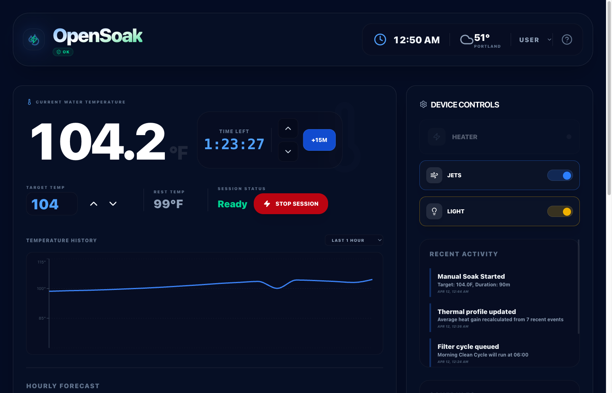
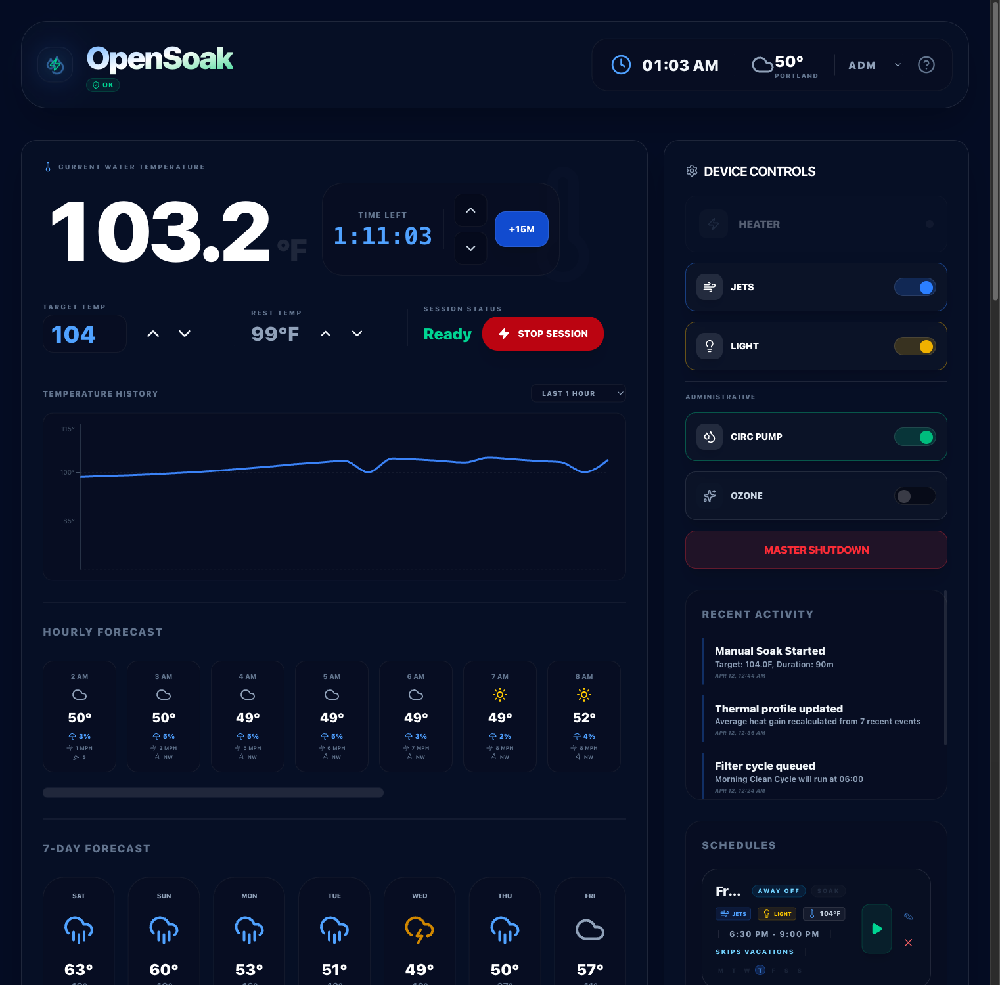
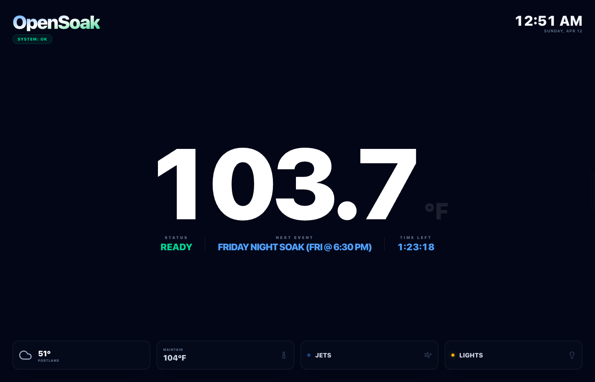
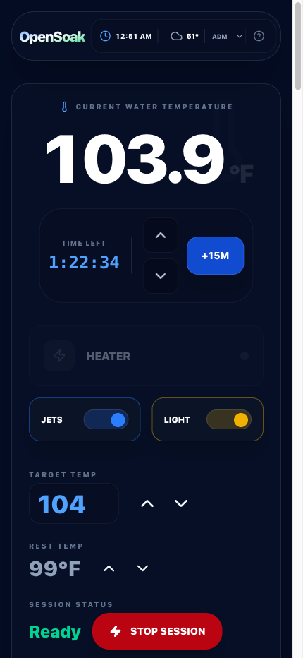
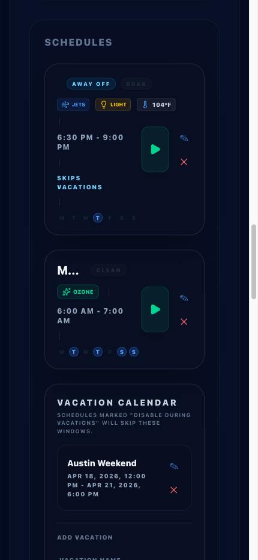
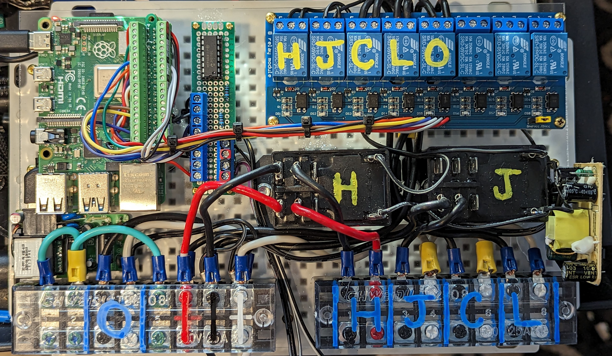

# OpenSoak 🛁

<p align="center">
  
</p>

OpenSoak is a modern, open-source hot tub control system designed to run on a Raspberry Pi. It replaces traditional spa pack interfaces with a safety-first Python control engine, a FastAPI backend, and a polished multi-mode dashboard for everyday control, deep admin access, and glanceable viewer displays.

## 📸 Screenshots

### Web Interface
| User Mode (Active Soak) | Admin Mode (Settings) | Viewer Mode |
| :---: | :---: | :---: |
| <a href="docs/screenshots/Screenshot-User.png"></a> | <a href="docs/screenshots/Screenshot-Admin.png"></a> | <a href="docs/screenshots/Screenshot-Viewer.png"></a> |

### Mobile Experience
| Mobile Admin View 1 | Mobile Admin View 2 |
| :---: | :---: |
| <a href="docs/screenshots/Screenshot-Mobile-Admin1.png"></a> | <a href="docs/screenshots/Screenshot-Mobile-Admin2.png"></a> |

## 🚀 Features

- **Safety-first control logic:** Heater interlock, configurable high-limit protection, flow-aware shutdowns, and an admin master shutdown path are built into the control stack.
- **Three tailored interfaces:** Dedicated `Viewer`, `User`, and `Admin` modes let the same system work as a 10-foot display, a daily control surface, or a full operations console.
- **Precision soak control:** Hysteresis-based temperature management supports separate rest and soak targets, live timer adjustments, quick session extensions, and one-tap session stop controls.
- **Weather-aware dashboard:** Current conditions, hourly forecast, and 7-day outlook are integrated directly into the spa UI for planning sessions around real conditions.
- **Rich scheduling engine:** Create soak sessions, clean cycles, and ozone runs with day-of-week scheduling, run-now actions, and schedule-specific device settings.
- **Vacation scheduling:** Mark away windows so recurring soak schedules can automatically skip while you are out of town.
- **Electric cost analysis:** Track real-time runtime by component and estimate daily, monthly, and all-time operating cost from your configured wattage and local kWh pricing.
- **Thermal efficiency analytics:** OpenSoak logs heat-up and cool-down behavior, estimates insulation loss, charts recent thermal performance, and projects monthly cost from real-world system behavior.
- **Admin observability:** Recent activity, support logs, schedule management, vacation management, and system settings are all available from the dashboard instead of requiring SSH for routine checks.
- **Mobile-first glass UI:** The React frontend is optimized for phones, tablets, and desktop displays with a polished, high-contrast interface and real-time status feedback.
- **Hardware emulation:** A full simulation mode makes it possible to test logic, analytics, and UI flows on a regular computer without attached spa hardware.
- **Android TV & home theater support:**
  - **Native TV app:** Optimized for NVIDIA Shield and other Android TV devices with D-pad navigation and a clean viewer-first layout.
  - **Command center widget:** A high-legibility home screen widget surfaces temperature, countdown, and forecast data at a glance.
  - **Multi-host connectivity:** The Android client can discover or manually switch between multiple OpenSoak backends.

## 🛠 Hardware Architecture

OpenSoak is designed to interface with standard spa equipment using industrial-grade components and a modular wiring approach.

-   **Raspberry Pi:** Serves as the central compute module, hosting the FastAPI backend and React frontend.
-   **8-Channel Relay Board:** Provides isolated control over high-voltage loads including heaters, pumps, lights, and ozone generators.
-   **MCP3008 ADC:** Enables high-precision analog-to-digital conversion for temperature monitoring.
-   **10k Thermistors:** Reliable temperature sensing using Steinhart-Hart coefficients for laboratory-grade accuracy.
-   **Physical Safety:** Support for hardware-level flow switches to ensure fail-safe operation.



### **Pinout Configuration**

| Component | BCM Pin | Physical Pin | Logic |
| :--- | :---: | :---: | :--- |
| **Heater** | 4 | 7 | Active Low |
| **Light** | 5 | 29 | Active Low |
| **Ozone** | 6 | 31 | Active Low |
| **Circulation Pump** | 22 | 15 | Active Low |
| **Jet Pump** | 27 | 13 | Active Low |

### **ADC / Sensor Wiring (MCP3008 SPI)**

| MCP3008 Pin | Pi BCM | Physical Pin | Function |
| :--- | :---: | :---: | :--- |
| **VDD / VREF** | 3.3V | 1 / 17 | Power / Reference |
| **AGND / DGND** | GND | 6 / 9 / 14 | Ground |
| **CLK** | 11 | 23 | SPI Clock |
| **DOUT** | 9 | 21 | Master In Slave Out (MISO) |
| **DIN** | 10 | 19 | Master Out Slave In (MOSI) |
| **CS / SHDN** | 8 | 24 | Chip Select (CE0) |
| **CH0** | - | - | Water Temp Sensor |
| **CH1** | - | - | Hi-Limit Sensor |

> **Thermistor Note:** Sensors are wired as a voltage divider with a **10k Ohm series resistor** to ground.

## 📦 Installation

### 1. Clone the repository
```bash
git clone https://github.com/mcglothi/opensoak.git
cd opensoak
```

### 2. Automated Setup
Run the setup script to create a Python virtual environment and install all dependencies:
```bash
./scripts/setup.sh
```

### 3. Configuration
Edit `backend/.env` to match your specific GPIO pinout and temperature thresholds.

### 4. Run Development Servers
```bash
./scripts/start.sh
```
Access the dashboard at `http://<your-pi-ip>:5173` and the API docs at `http://<your-pi-ip>:8000/docs`.

### 5. Android TV Deployment
To install the native app on an NVIDIA Shield or similar device:
1.  **Enable Developer Options:** Go to *Settings > Device Preferences > About* and click *Build* 7 times.
2.  **Enable Network Debugging:** In *Developer options*, enable *Network Debugging* and note the IP address.
3.  **Install via ADB:**
    ```bash
    adb connect <shield-ip>
    adb install frontend/android/app/build/outputs/apk/debug/app-debug.apk
    ```
4.  **Configuration:** On first launch, the app will attempt to discover the backend at `http://opensoak`. If not found, use the **Manual Setup** button to enter your Pi's IP.

## 🛡 Safety Warning

**Use at your own risk.** Controlling high-voltage hot tub equipment (heaters, pumps) is inherently dangerous. This software is provided "as is" without warranty. Always use a GFCI breaker and consult a qualified electrician when wiring your hot tub controller.

## 📄 License

This project is licensed under the [GNU General Public License v3.0](LICENSE).
